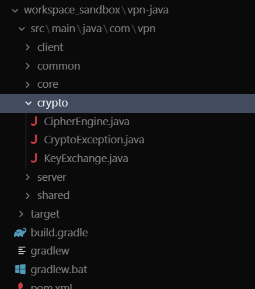
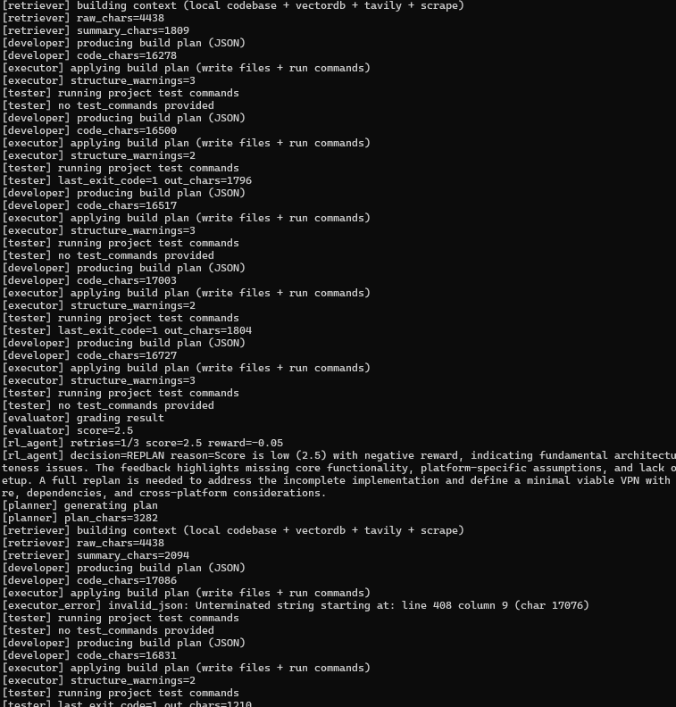

# Autonomous Coding Agent
This project is an autonomous coding pipeline powered by LLM agents and LangGraph.  
It converts a user prompt into a complete software solution through iterative planning, execution, testing, and evaluation.

## Architecture Overview

The system follows a multi-agent architecture where each component is responsible for a specific stage in the autonomous coding lifecycle.
The process begins with a user prompt and flows through planning, retrieval, execution, testing, and evaluation, with a reinforcement learning (RL) agent continuously optimizing decisions based on feedback.

## Workflow Explanation

1. **Prompt -> Planning Agent**  
   The process starts with a user prompt. The Planning Agent interprets the task and generates a high-level system design along with a step-by-step execution plan.

2. **Planning Agent -> Agent Orchestrator**  
   The plan is passed to the Orchestrator, which coordinates all downstream agents and manages execution flow.

3. **Knowledge Retriever**  
   The Orchestrator queries the retriever to gather relevant context from the internet, vector database, and local knowledge sources.

4. **Developer Agent**  
   Using the plan and retrieved context, the Developer Agent generates or modifies code, including file structures, edits, and commands.

5. **File Tools & Execution Environment**  
   The Developer and Tester interact with file tools to write/update files and with the execution environment to run code.

6. **Tester Agent**  
   The Tester validates the generated solution by running tests and checking correctness.

7. **Evaluator Agent**  
   The Evaluator analyzes outputs, test results, and overall implementation quality to generate a performance score.

8. **Reward Function & Human-in-the-loop**  
   The evaluation is converted into a reward signal, optionally incorporating human feedback.

9. **RL Agent**  
   The RL Agent uses this reward to decide whether to continue iterating, refine the plan, or terminate the process.

10. **Feedback Loop**  
    The RL Agent can send feedback back to the Planning Agent and Orchestrator, enabling continuous improvement and iterative refinement.

## APIs & Integrations

- **DeepSeek API**: Core LLM used for planning, code generation, evaluation, and decision-making.
- **Tavily API (Optional)**: Provides real-time web search for documentation and external references.
- **Scrapling**: Extracts structured content from web pages for enhanced retrieval.
- **ChromaDB**: Local vector database used for storing and retrieving contextual knowledge across iterations.

## Tools & Capabilities

- **File Tools**: Enable reading, writing, and editing of project files, including precise in-place modifications.
- **Command Runner**: Executes setup, build, and test commands with timeout control and safe background handling.
- **Python Runner**: Supports quick execution of scripts for validation and debugging.
- **Retrieval Helpers**: Fetch relevant context from the local codebase, vector database, and web sources.

## Outputs

I tasked the agent with building a VPN application from scratch using Java.  
The agent designed and generated the project autonomously under **`workspace_sandbox/`** (for example `workspace_sandbox/vpn-java/` or similar, depending on the task).  
The screenshots below show the resulting layout and terminal output from a run.

## Where generated projects live

All code the agent creates is written under **`workspace_sandbox/`** (relative to the repo root).  
Each run typically produces or updates a folder such as `workspace_sandbox/<project_name>/` with source files, build configs, and the same structure you would commit to a real repository. Open that directory in your IDE to browse, run, or extend what the agent built.

### Screenshots

**Architecture / overview**

**Terminal run**

